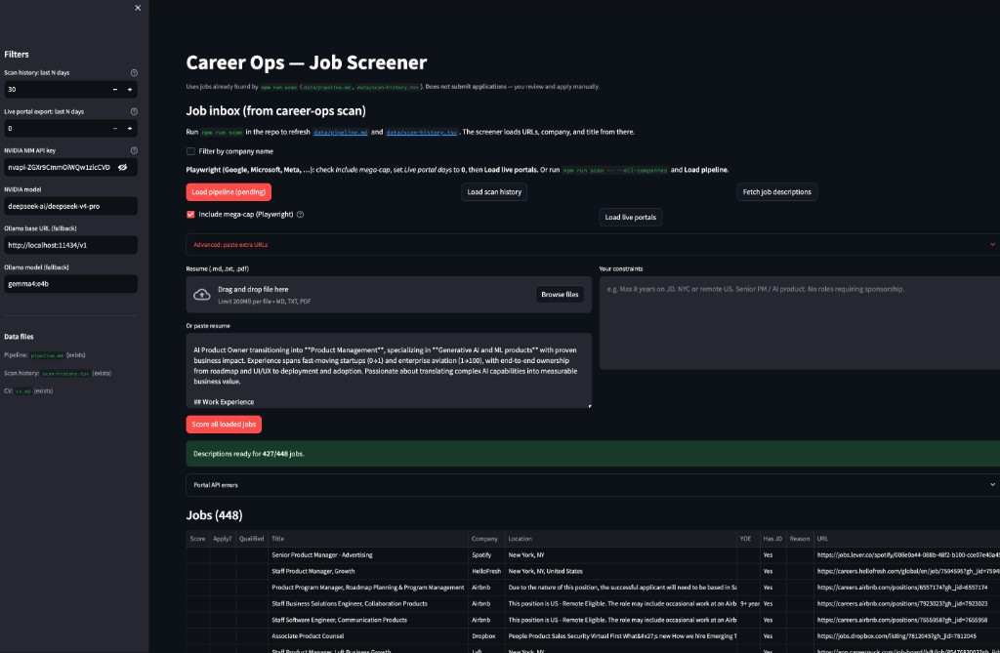

# career-ops (fork)

Extensions on top of [santifer/career-ops](https://github.com/santifer/career-ops) — Streamlit job screener, local LLM (Ollama / NVIDIA NIM), Playwright mega-cap scraping, and portal export scripts.



**This fork does not submit applications.** Screening and scoring only; you apply manually.

## Quick start

```bash
npm install && npx playwright install chromium
cp templates/portals.example.yml portals.yml
cp .env.example .env   # NVIDIA_API_KEY, optional Ollama
npm run scan
```

**Streamlit UI:**

```bash
cd streamlit_app && python3 -m venv .venv && source .venv/bin/activate
pip install -r requirements.txt && streamlit run app.py
```

Details: [streamlit_app/README.md](streamlit_app/README.md)

## Credits

| | |
|---|---|
| **This repo** | [0sparsh2/career-ops](https://github.com/0sparsh2/career-ops) |
| **Upstream** | [santifer/career-ops](https://github.com/santifer/career-ops) by [Santiago Fernández de Valderrama](https://santifer.io) |

Full upstream README (features, `/career-ops` commands, setup): see multilingual `README.*.md` files and [docs/SETUP.md](docs/SETUP.md).

## License

MIT
